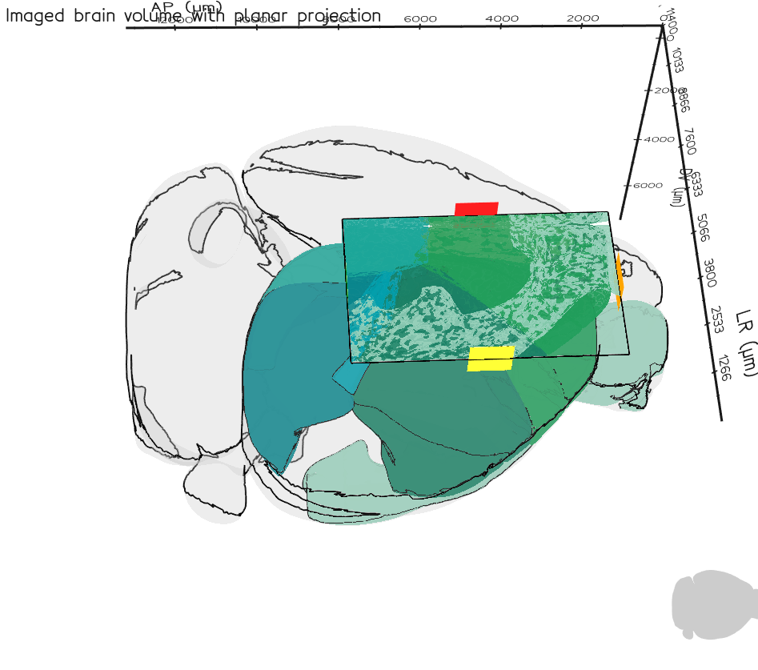

# brainreg3D
A pipeline for manual registration of cortical regions using 3D projection onto an experimentally obtained 2D image.



Register a widefield image using the command line:
```bash
$ python -m brainreg3D ./your_image.tif
```

Write custom python scripts to register images:
```python
#!/usr/bin/python3

from brainreg3D import BrainReg3D
reg = BrainReg3D('./your_image.tif')
reg.run()
```

[description.md](description.md) contains a more thorough overview of the workflow.

# Installation
Installation can be done in one of two ways: install using pip, or through repo cloning and manual installation. The latter is recommended for the example scripts and data to be included in the install.

## Clone repository

### Windows
```powershell
python -m venv .venv
./.venv/Scripts/Activate.ps1

git clone https://github.com/JoeRicotta/brainreg3D.git
cd brainreg3D

python -m pip install -r requirements.txt
python example.py
```

### Mac
```bash
python3 -m venv .venv
source .venv/bin/activate

git clone https://github.com/JoeRicotta/brainreg3D.git
cd brainreg3D

pip install -r requirements.txt

python example.py
```

## Install with pip
(pypi repo is in alpha, no guarantees on successful install.)
```bash
python -m pip install -i https://test.pypi.org/simple/ brainreg3D
```

# Acknowledgements
brainreg3D relies heavily upon the [vedo](https://vedo.embl.es/) and [brainrender](https://github.com/brainglobe/brainrender) frameworks. Thank you to these teams for making this pipeline possible.